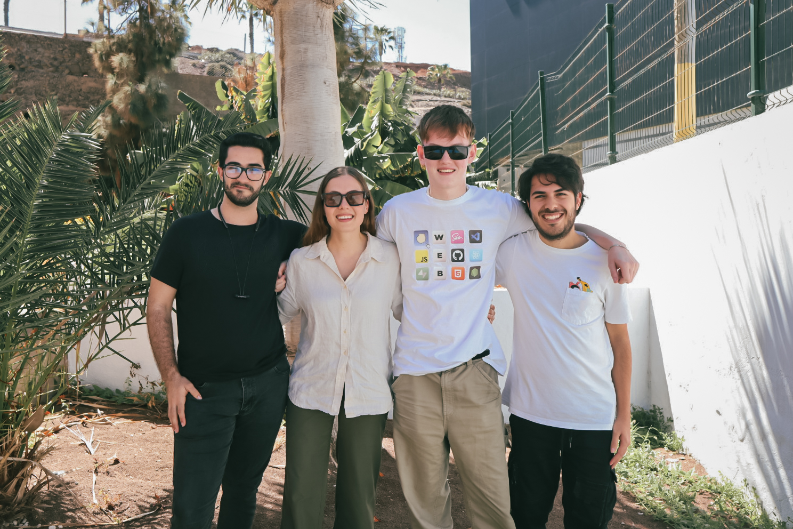

  <h1 align="center">Sustainable Island Gran Canaria 2024</h1>

 GreenHole by KALM

  <a href="https://www.figma.com/file/dzrpmXYGBpc7XlZuVvQA1Q/UX-Las-Palmas-Kalm-Group?type=whiteboard&node-id=0%3A1&t=6OwvXRZ27RBkKI8s-1"><strong>FigJam file</strong></a> ·
  <a href="https://www.figma.com/file/GnBh4hvgNc5bjtQVf7jKpH/Kalm-project?type=design&node-id=103%3A4518&mode=design&t=zvTIItD3prI8Z12S-1"><strong>Figma file</strong></a> ·
  <a href="https://green-hole.vercel.app/"><strong>Vercel</strong></a> ·

 
 
## Presentation

You can view a fully working demo at [https://www.figma.com/proto/GnBh4hvgNc5bjtQVf7jKpH/Kalm-project?type=design&node-id=589-5168&t=HUbxr5505aRqeJvM-1&scaling=contain&page-id=589%3A4847&starting-point-node-id=589%3A5223&mode=design]

## Demo

You can view a fully working demo at [green-hole.vercel.app](green-hole.vercel.app).
